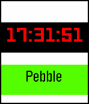

# Pebble - Simple Watchface
A simple watchface with color and a text banner for the Pebble Time created mainly for learning the Pebble C SDK and as a simple starter project for reference.

## Screenshot

# License
Licensed under the [MIT License](LICENSE).

Short description (not a replacement for the [LICENSE](LICENSE)): Please credit me if you are distributing this code by any means, even if you are just publishing an app that is based off of this code.
